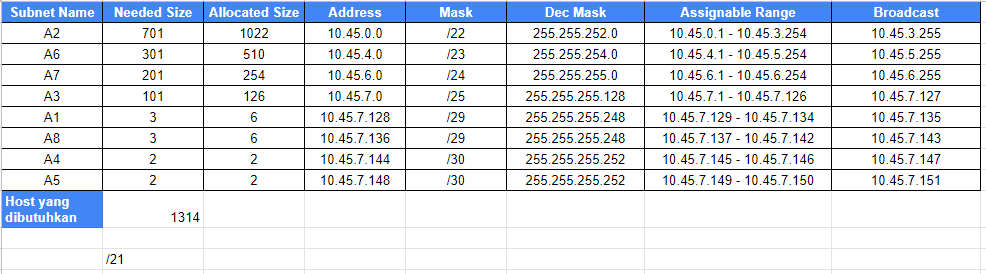

# Jarkom-Modul-5-T7-2021      
### Laporan Resmi Pengerjaan Sesi Lab Jaringan Komputer     
        
#### Nama Anggota Kelompok :      
1. Naufal Aprilian (05311940000007)     
2. Bryan Yehuda Mannuel (05311940000021)      
3. Mulki Kusumah    


## Soal Modul 5
Setelah kalian mempelajari semua modul yang telah diberikan, Luffy ingin meminta bantuan untuk terakhir kalinya kepada kalian. Dan kalian dengan senang hati mau membantu Luffy.      
1. Tugas pertama kalian yaitu membuat topologi jaringan sesuai dengan rancangan yang diberikan Luffy
2. Keterangan : 	      
        Doriki adalah DNS Server        
		Jipangu adalah DHCP Server       
		Maingate dan Jorge adalah Web Server      
		Jumlah Host pada Blueno adalah 100 host      
		Jumlah Host pada Cipher adalah 700 host      
		Jumlah Host pada Elena adalah 300 host       
		Jumlah Host pada Fukurou adalah 200 host        
3. Karena kalian telah belajar subnetting dan routing, Luffy ingin meminta kalian untuk membuat topologi tersebut menggunakan teknik CIDR atau VLSM. setelah melakukan subnetting, 
4. Kalian juga diharuskan melakukan Routing agar setiap perangkat pada jaringan tersebut dapat terhubung.
5. Tugas berikutnya adalah memberikan ip pada subnet Blueno, Cipher, Fukurou, dan Elena secara dinamis menggunakan bantuan DHCP server. Kemudian kalian ingat bahwa kalian harus setting DHCP Relay pada router yang menghubungkannya.

## Jawaban Modul 
### Perhitungan VLSM
Berikut adalah topologi dan pembagian subnet


Berikut adalah Tree yang sudah kita buat


Berikut adalah Perhitungannya



### Konfigurasi Network setiap node
[ Fosha ]
```
auto eth0
iface eth0 inet dhcp

auto eth1
iface eth1 inet static
	address 10.45.7.145
	netmask 255.255.255.252

auto eth2
iface eth2 inet static
	address 10.45.7.149
	netmask 255.255.255.252
```

[ Water 7 ]
```
auto eth0
iface eth0 inet static
	address 10.45.7.146
	netmask 255.255.255.252
auto eth1
iface eth1 inet static
	address 10.45.7.129
	netmask 255.255.255.248
auto eth2
iface eth2 inet static
	address 10.45.7.1
	netmask 255.255.255.128
auto eth3
iface eth3 inet static
	address 10.45.0.1
	netmask 255.255.252.0
```

[  Guanhao ]
```
auto eth0
iface eth0 inet static
	address 10.45.7.150
	netmask 255.255.255.252
auto eth1
iface eth1 inet static
	address  10.45.7.137
	netmask 255.255.255.248
auto eth2
iface eth2 inet static
	address  10.45.4.1
	netmask 255.255.254.0
auto eth3
iface eth3 inet static
	address  10.45.6.1
	netmask 255.255.255.0
```

[ BLUENO ], [ CIPHER ], [ ELENA ], [ FUOROU ]
```
auto eth0
iface eth0 inet dhcp

```
[ DORIKI ]
```
auto eth0
iface eth0 inet static
	address 10.45.7.130
	netmask 255.255.255.248
        gateway 10.45.7.129


```
[ JIPANGU ]
```
auto eth0
iface eth0 inet static
	address 10.45.7.131
	netmask 255.255.255.248
        gateway 10.45.7.129
```

[ MAINGATE ]
```
auto eth0
iface eth0 inet static
	address 10.45.7.139
	netmask 255.255.255.248
        gateway 10.45.7.137
```

[ JORGE ]
```
auto eth0
iface eth0 inet static
	address 10.45.7.138
	netmask 255.255.255.248
        gateway 10.45.7.137

```

### Routing dan Konfigurasi DNS, Web server, DHCP Server, dan DHCP relay
[ Foosha ]
```
route add -net 10.45.7.0 netmask 255.255.255.128 gw 10.45.7.146 #BLUENO
route add -net 10.45.0.0 netmask 255.255.252.0 gw 10.45.7.146 #CIPHER
route add -net 10.45.7.128 netmask 255.255.255.248 gw 10.45.7.146 #DORIKI & JIPANGU

route add -net 10.45.4.0 netmask 255.255.254.0 gw 10.45.7.150 #ELENA
route add -net 10.45.6.0 netmask 255.255.255.0 gw 10.45.7.150 #FUKORO
route add -net 10.45.7.136 netmask 255.255.255.248 gw 10.45.7.150 #Maingate & Jourge
```
[ Water7 ]
```
route add -net 0.0.0.0 netmask 0.0.0.0 gw 10.45.7.145
```

[ Guanhao ]
```
route add -net 0.0.0.0 netmask 0.0.0.0 gw 10.45.7.149
```   
[ Doriki adalah DNS Server ]
Pada File  > /etc/bind/named.conf.options
```
apt update
apt install bind9 -y
echo '
options {
        directory "/var/cache/bind";
        forwarders {
                192.168.122.1;
        };
        allow-query { any; };
        auth-nxdomain no;    # conform to RFC1035
        listen-on-v6 { any; };
};
```
Kemudian lakukan Restart Dengan `service bind9 restart`      
[ Jipangu adalah DHCP Server ]        
Pada File  > /etc/default/isc-dhcp-server     
```
apt update
apt install isc-dhcp-server -y
echo '
INTERFACES="eth0"
```
Pada File > /etc/dhcp/dhcpd.conf
```
echo '
ddns-update-style none;
option domain-name "example.org";
option domain-name-servers ns1.example.org, ns2.example.org;
default-lease-time 600;
max-lease-time 7200;
log-facility local7;
subnet 10.45.0.0 netmask 255.255.252.0 {
    range 10.45.0.2 10.45.3.254;
    option routers 10.45.0.1;
    option broadcast-address 10.45.3.255;
    option domain-name-servers 10.45.7.130;
    default-lease-time 360;
    max-lease-time 7200;
}
subnet 10.45.7.0 netmask 255.255.255.128 {
    range 10.45.7.2 10.45.7.126;
    option routers 10.45.7.1;
    option broadcast-address 10.45.7.127;
    option domain-name-servers 10.45.7.130;
    default-lease-time 720;
    max-lease-time 7200;
}
subnet 10.45.4.0 netmask 255.255.254.0 {
    range 10.45.4.2 10.45.5.254;
    option routers 10.45.4.1;
    option broadcast-address 10.45.5.255;
    option domain-name-servers 10.45.7.130;
    default-lease-time 720;
    max-lease-time 7200;
}
subnet 10.45.6.0 netmask 255.255.255.0 {
    range 10.45.6.2 10.45.6.254;
    option routers 10.45.6.1;
    option broadcast-address 10.45.6.255;
    option domain-name-servers 10.45.7.130;
    default-lease-time 720;
    max-lease-time 7200;
}
subnet 10.45.7.128 netmask 255.255.255.248 {}
subnet 10.45.7.144 netmask 255.255.255.252 {}
subnet 10.45.7.148 netmask 255.255.255.252 {}
subnet 10.45.7.136 netmask 255.255.255.248 {}
``` 
Lakukan Restart Dengan `service isc-dhcp-server restart`

[ GUANHAO sebagai DHCP Relay ]
```
apt update
apt install isc-dhcp-relay -y
echo '
SERVERS="10.45.7.131"
INTERFACES="eth2 eth3 eth1 eth0"
OPTIONS=""
' > /etc/default/isc-dhcp-relay
service isc-dhcp-relay restart
```

[ WATER7 sebagai DHCP Relay ]
```
apt update
apt install isc-dhcp-relay -y
echo '
SERVERS="10.45.7.131"
INTERFACES="eth2 eth3 eth0 eth1"
OPTIONS=""
' > /etc/default/isc-dhcp-relay
service isc-dhcp-relay restart
```

[ Maingate dan Jorge adalah Web Server ]
```
apt update
apt install apache2 -y
service apache2 start
echo "$HOSTNAME" > /var/www/html/index.html
```

### Soal Nomor 1
Agar topologi yang kalian buat dapat mengakses keluar, kalian diminta untuk mengkonfigurasi Foosha menggunakan iptables, tetapi Luffy tidak ingin menggunakan MASQUERADE.

### Jawaban Nomor 1
[ FOOSHA ]
```
IPETH0="$(ip -br a | grep eth0 | awk '{print $NF}' | cut -d'/' -f1)"
iptables -t nat -A POSTROUTING -o eth0 -j SNAT --to-source "$IPETH0" -s 10.45.0.0/21
```

### Soal Nomor 2
Kalian diminta untuk mendrop semua akses HTTP dari luar Topologi kalian pada server yang merupakan DHCP Server dan DNS Server demi menjaga keamanan.

### Jawaban Nomor 2
[ FOOSHA ]
```
iptables -A FORWARD -d 10.45.7.131 -i eth0 -p tcp --dport 80 -j DROP
iptables -A FORWARD -d 10.45.7.130 -i eth0 -p tcp --dport 80 -j DROP
```

### Soal Nomor 3
Karena kelompok kalian maksimal terdiri dari 3 orang. Luffy meminta kalian untuk membatasi DHCP dan DNS Server hanya boleh menerima maksimal 3 koneksi ICMP secara bersamaan menggunakan iptables, selebihnya didrop.

### Jawaban Nomor 3
[ Jipangu ]
Reject bila terdapat PING ICMP Lebih dari 3
```
iptables -A INPUT -p icmp -m connlimit --connlimit-above 3 --connlimit-mask 0 -j DROP
```
[ Doriki ]     
Reject bila terdapat PING ICMP Lebih dari 3
```
iptables -A INPUT -p icmp -m connlimit --connlimit-above 3 --connlimit-mask 0 -j DROP
```
### Soal Nomor 4
Akses dari subnet Blueno dan Cipher hanya diperbolehkan pada pukul 07.00 - 15.00 pada hari Senin sampai Kamis

### Jawaban Nomor 4
 
[ Blueno ]    
```
iptables -A INPUT -s 10.45.7.0/25 -m time --weekdays Fri,Sat,Sun -j REJECT
iptables -A INPUT -s 10.45.7.0/25 -m time --timestart 00:00 --timestop 06:59 --weekdays Mon,Tue,Wed,Thu -j REJECT
iptables -A INPUT -s 10.45.7.0/25 -m time --timestart 15:01 --timestop 23:59 --weekdays Mon,Tue,Wed,Thu -j REJECT
```
[ Cipher ]
```
iptables -A INPUT -s 10.45.0.0/22 -m time --weekdays Fri,Sat,Sun -j REJECT
iptables -A INPUT -s 10.45.0.0/22 -m time --timestart 00:00 --timestop 06:59 --weekdays Mon,Tue,Wed,Thu -j REJECT
iptables -A INPUT -s 10.45.0.0/22 -m time --timestart 15:01 --timestop 23:59 --weekdays Mon,Tue,Wed,Thu -j REJECT
```
### Soal Nomor 5
Akses dari subnet Elena dan Fukuro hanya diperbolehkan pada pukul 15.01 hingga pukul 06.59 setiap harinya selain itu di reject

### Jawaban Nomor 5
Akses dari subnet Elena dan Fukuro
```
iptables -A INPUT -s 10.45.4.0/23 -m time --timestart 07:00 --timestop 15:00 -j REJECT #Elena
iptables -A INPUT -s 10.45.6.0/24 -m time --timestart 07:00 --timestop 15:00 -j REJECT #Fukuro
```

### Soal Nomor 6
Karena kita memiliki 2 Web Server, Luffy ingin Guanhao disetting sehingga setiap request dari client yang mengakses DNS Server akan didistribusikan secara bergantian pada Jorge dan Maingate

### Jawaban Nomor 6
[ Guanhao ]
```
iptables -A PREROUTING -t nat -p tcp -d 10.45.7.130 -m statistic --mode nth --every 2 --packet 0 -j DNAT --to-destination 10.45.7.138:80
iptables -A PREROUTING -t nat -p tcp -d 10.45.7.130 -j DNAT --to-destination 10.45.7.139:80
```

## Kendala
